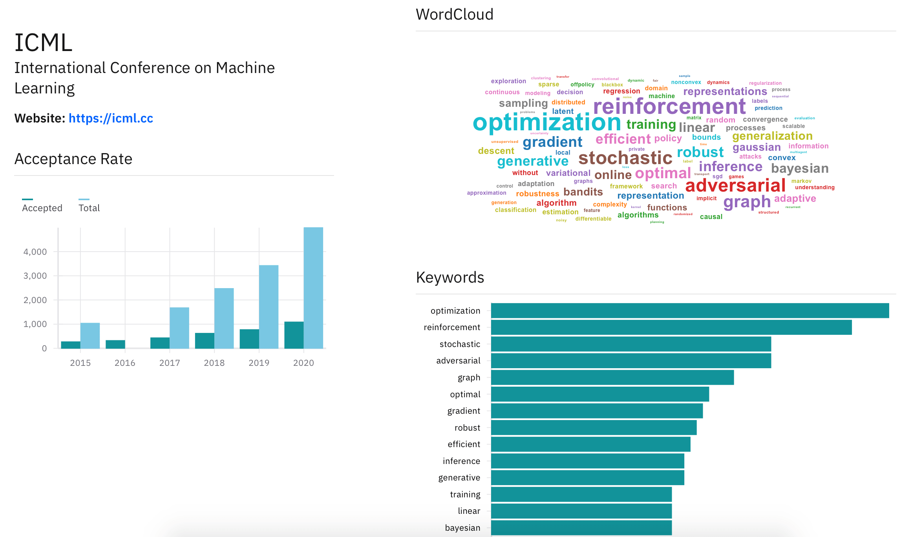

# conference-viz
Statistics, Paper Links and Visualizations of Machine Learning Conferences 



## Getting Started

### Crawling Data and Generating Stats

#### Prerequisites
- [Python 3.6+](https://www.python.org)
- Create a virtual environment and install dependencies:
```
python3 -m venv conference-viz
source conference-viz/bin/activate
pip install -r requirements.txt
```

#### For Crawling Data
Run this from root folder:
```
python crawlers/<conference>.py
```

#### For Generating arXiv Data and Statistics
Open [generate_links_and_stats.ipynb](generate_links_and_stats.ipynb) for doing the same.

### UI

#### Prerequisites
- [Node.js](https://nodejs.org)
- [React](https://reactjs.org)
- [IBM Carbon Design Components](https://react.carbondesignsystem.com/?path=/story/*)
- [Uber React-Vis](https://uber.github.io/react-vis/)

#### Running
- Clone the repository and run the following to run UI:
```
cd frontend
npm install
npm start
```
- For building
```
npm run build
```
- For running tests
```
npm run test
```
- For formatting code
```
npm run format
```

## Acknowledgement
Thanks to [Joohong Lee](http://github.com/roomylee) for inspiring via his works: [ACL](https://github.com/roomylee/ACL-2020-Papers) and [EMNLP](https://github.com/roomylee/EMNLP-2019-Papers)
